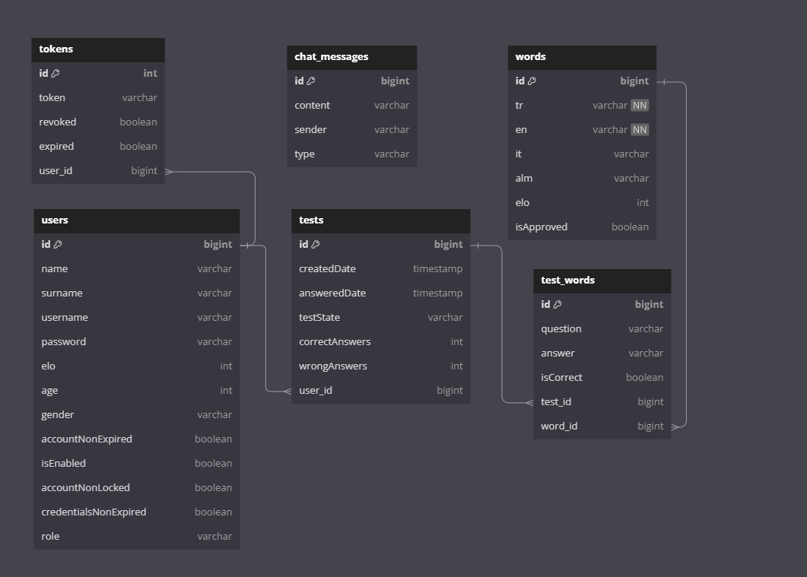

# WORD-VAULT

[DB diagram text](assets/dbdiagram.txt)

## Technologies

---
- Java 17
- Spring Boot 3.2.2
- Elasticsearch
- Kafka
- Debezium
- Resilience4j
- Spring Cache
- Open API Documentation
- Spring Data JPA
- H2 In Memory Database
- Restful API
- Maven
- Junit5
- Integration Tests
- Docker
- Docker Compose
- Prometheus
- Grafana

Bir kelime kaydedildiğinde veritabanının ürettiği logları dinleyen Debezium bunları kafkaya yazıyor. Daha sonrasında bu topici okuyan listener veriyi elasticsearche kaydediyor. Böylelikle veri asenkron olarak elasticsearche geçirilmiş oluyor.

Test için kelimeleri veritabanından çekmek için özel bir SQL sorgusu kullanılıyor. WordRepository'nin içinde bulabilirsiniz.

Uygulama hala geliştirme aşamasında oldugu için sürekli güncellenecektir.

Word-Vault, yabancı dil öğrenirken sıkça karşılaşılan sorunları çözmek amacıyla tasarlanmış bir uygulamadır. Bu uygulama, bilinmeyen kelimeleri not almanıza ve daha sonra bu kelimeleri tekrar etmek için otomatik sınavlar oluşturmanıza olanak tanır. Aynı zamanda önemli konuları not almanızı sağlar ve bu notlara kolayca erişmenizi sağlar.

## Özellikler

- Bilmediğiniz kelimeleri ve önemli konuları ekleyebilirsiniz.
- Otomatik sınavlar oluşturarak öğrendiğiniz kelimeleri tekrarlayabilirsiniz.
- Kelimelerinizi özelleştirebilir, örnek cümleler ve notlar ekleyebilirsiniz.
- Kullanıcı puanlarına dayalı olarak kelimelerin zorluk seviyeleri ayarlanır.
- Sınav modları arasında onaylanmış kelimelerle ve kendi eklediğiniz kelimelerle sınav yapabilirsiniz.

## Puan Algoritması

- Kullanıcılar kelimeleri doğru cevaplarsa puan kazanır, yanlış cevaplar ise puanlarını düşürür.
- Kelimelerin zorluk seviyeleri kullanıcı puanlarına göre ayarlanır.
- Kelimeler zamanla unutulma riskiyle karşı karşıya kaldıkça puanları artar ve tekrar önlerine çıkar.

## Yapılacaklar

- Kullanıcılar kelimeleri ekleyebilir ve onaylanmamış kelimelerin listesini görebilir.
- Sistem tarafından eklenen kelimeler onaylanmış olarak işaretlenir.
- Kullanıcılar önemli konuları ve notları ekleyebilir.
- Kullanıcı profillerinde istatistikleri görüntüleyebilir.
- Otomatik sınav oluşturma ve farklı sınav modları eklenecektir.

## Yapım Aşamaları

1. Kelime ekleme özelliği geliştirilecek.
2. Authentication sistemi entegre edilecek.
3. Sınav modları ve puan algoritması işlevsel hale getirilecek.
4. Konu ekleme ve not alma özellikleri geliştirilecek.
5. Kullanıcı profili oluşturulacak ve istatistikler eklenecek.

